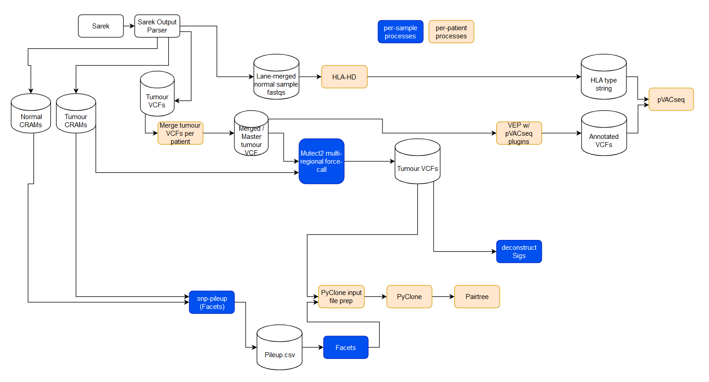

# NeoSarek

A Nextflow pipeline designed for use subsequent to the nf-core Sarek pipeline
that performs multi-sample / multi-regional mutation calling (Mutect2), copy
number calling (Facets), HLA-typing (HLA-HD), Neoantigen calling (pVACseq), and
phylogenetic reconstruction (Pyclone + Pairtree).

# Usage

As copy number solutions need to be inspected manually, the pipeline is run in two stages.

The initial stage performs copy number calling, multi-regional mutation calling,
functional annotation of mutations, HLA typing and neoantigen calling.

The second stage performs clustering of mutations with Pyclone, amalgamation of mutation and 
copy number data per patient, and phylogenetic inference with Pairtree


Example first stage run:

```
#standard run
cd ~/work/cpi.nextflow/pipelines/mela/
nextflow ./main.nf \
    --samplesheet ~/work/ucl/data/mela.peace.new/pea004.ffpe.sarek.samplesheet.csv \
    --outputdir /nemo/project/proj-tracerX/working/CMELA/alex/work/cpi.nextflow/pipelines/mela/output/pea004_ffpe_roq \
    --sarek_output_dir ~/work/cpi.nextflow/pipelines/sarek/output_pea004/ \
    -with-timeline run_report/pea004.ffpe.hla.roq.timeline.txt \
    -with-trace run_report/pea004.ffpe.hla.roq.trace.txt \
    -with-report run_report/pea004.ffpe.hla.roq.rep.html \
    -profile cluster \
    --stage 'initial' \
```

Example second stage run:

```
#standard run
cd ~/work/cpi.nextflow/pipelines/mela/
nextflow ./main.nf \
    --samplesheet ~/work/ucl/data/mela.peace.new/pea004.ffpe.sarek.samplesheet.csv \
    --outputdir /nemo/project/proj-tracerX/working/CMELA/alex/work/cpi.nextflow/pipelines/mela/output/pea004_ffpe_roq \
    --sarek_output_dir ~/work/cpi.nextflow/pipelines/sarek/output_pea004/ \
    -with-timeline run_report/pea004.ffpe.hla.roq.timeline.txt \
    -with-trace run_report/pea004.ffpe.hla.roq.trace.txt \
    -with-report run_report/pea004.ffpe.hla.roq.rep.html \
    -profile cluster \
    --stage 'review' \
```

# Pipeline schematic



# Pipeline parameters

## Basic input parameters

`samplesheet`: Samplesheet for NeoSarek - path to CSV file

`sarek_output_dir`: Path of Sarek output directory

`outputdir`: Path for NeoSarek output directory

`stub_data_dir`: Path of stub data directory; a development parameter

`stage`: String, specifies which stage of the pipeline to execute. Possible values are `initial`, `review` or `facets_only`

`conipher_prefix`: String. CONIPHER adds a prefix to all sample names, here we supply this prefix. Example: `PEA`

## Tool resource parameters

`hlahd_install_directory`: Path to HLAHD installation directory

`vepcache`: Path to VEP cache directory, required for pVACseq

`vepplugins`: Path to VEP plugin directory, required for pVACseq


## Genome resource parameters

`genome_reference`: Path to reference genome fasta file

`genome_index`: Path to reference genome index

`genome_dict`: Path to reference genome dictionary

`germline_resource`: Path to germline resource VCF file

`germline_resource_index`: Path to germline resource index

`panel_of_normals`: Path to panel of normals VCF file

`panel_of_normals_index`: Path to panel of normals index


# Multi-regional mutation calling process:

NeoSarek was designed with the Melanoma PEACE cohort in mind, where there are
many clonally-related samples from a single patient (in this case metastases
stemming from a singular origin.) Mutation-calling prior to NeoSarek is
performed with Mutect2 in Sarek using single-sample mode. As the samples are
clonally-related, we can expect that some mutations may be present across more
than one sample. However, these mutations may not always be called by Mutect2
if for example there is low alternate allele-frequency. The presense of a
mutation that passes the single-sample filters of Mutect2 (after correcting
for strand-bias artefacts or the possibility of contamination), in sample A
gives us more confidence that an identical mutation that may have
failed conventional filtering in sample B is legitimate.

To identify and call mutations with multi-sample support, we used a
force-calling approach rather than Mutect2's multi-regional calling mode, as
this gives us more fine-grained control over which mutations are called. To
perform this, we produce a master VCF containing all possible variants across
all samples of a patient, and force-call these alleles in individual tumour
samples using the `-alleles` and  `--force-call-filtered-alleles` arguments
to Mutect2.

# Process documentation

For more detailed documentation of subworkflows and processes, see `doc/processes.md`
